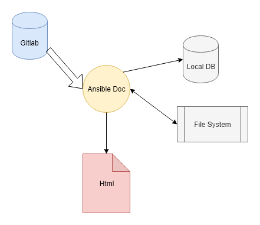
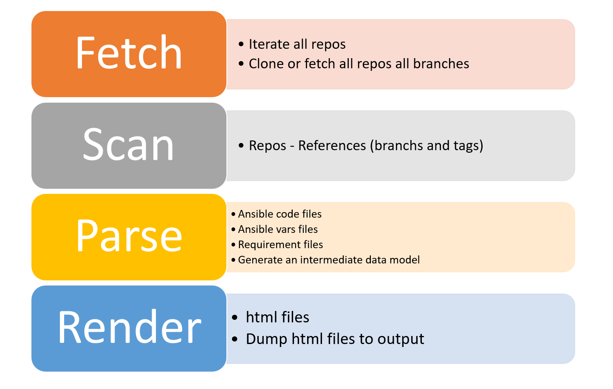

<!-- .slide: data-background="./images/adoc/back.png" -->

# Ansible Doc

---

### Content

+ Overview
+ Concepts
+ Architecture
+ Demo

---

### Overview

+ Why do we need a documentation tool?
+ What kind of documentation tool do we need?
+ Goals

----

### Numbers

+ 64 Roles
+ 23 Playbooks/Services
+ ~10 Playbooks/No Catalog
+ N Branches -> N Tags
+ Long ansible playbooks
+ 1 playbook -> N roles

Complexity is rising...

----

### What kind of documentation tool?

+ Doxygen, JavaDoc, docnet ...
+ Gitlab Searching tool

----

### Goals

+ To make easier to understand a solution
+ To allow to browser between different projects
+ Identify dependencies and risks

---

## Concepts

+ Solution/Service - Ansible Playbook 1:1?
+ Project (Gitlab)
+ Ansible Role internal and external
+ Git Reference Branches vs Tags

----

### Specific Concept

+ Project vs Artifact

  + Project is a Git Repo
  + Artifact is any concept/object/code with a version

+ Artifacts
  + Playbook
  + Inner roles
  + Roles
  + Ansible code

A project can contains multiple Artifacts and a artifacts can be bound with many other artifacts.

---

### Architecture

----

#### Process

---

---

### New Features

+ Cloudforms
  + Service dialogs
  + Data Stores
+ Get stadistics
+ Report standard compliance
+ Why not to be used by other Tribes

---

### Any Questions?

---

### Thank you!!

